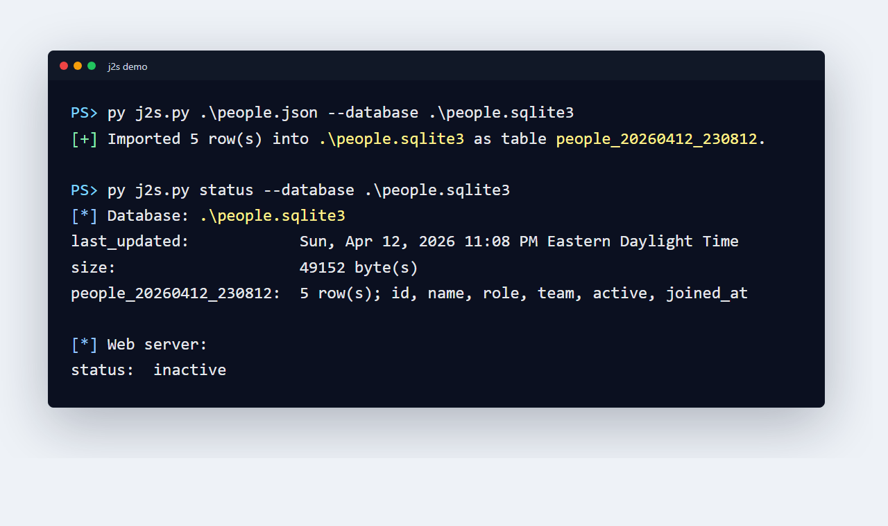
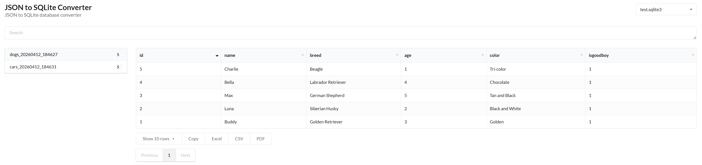

# JSON to SQLite Converter

JSON to SQLite Converter imports JSON files into SQLite databases and provides a local Flask web interface for searching, browsing, and exporting data from the indexed tables.

### Screenshots




### Requirements
- Python 3.14+

### Installation
```
python -m pip install -r requirements.txt
```

Optional symlink on Linux/macOS:

```
sudo ln -sf "$(pwd)/j2s.py" /usr/local/bin/j2s
```

On Windows, run the script directly:

```
python j2s.py status
```

### Commands
All commands accept an optional `--database <database>` argument. If omitted, the database is `db.sqlite3` in the current directory.

```
j2s file.json
```

Adds `file.json` as a new indexed table in the database. The table name is based on the source filename and import timestamp, for example `file_20260411_143000`.

```
j2s status
```

Shows database stats, table row counts, column names, and web server status.

```
j2s web start
```

Starts the local web server for viewing databases in a browser. If `--database` is omitted, the web viewer lists all `*.sqlite3` databases in the current directory and uses `db.sqlite3` when it exists. If `--database` is provided, that database is selected first and the other `*.sqlite3` databases in the current directory remain available in the dropdown.

```
j2s web stop
```

Stops the local web server. This command does not use `--database`.

### Examples
```
# Import a JSON file into ./db.sqlite3
j2s data.json

# Import into a specific database
j2s data.json --database inventory.sqlite3

# Show table structure and row counts
j2s status --database inventory.sqlite3

# Browse the database
j2s web start --database inventory.sqlite3
```

### JSON Input
The importer accepts a JSON array or object. Arrays of objects become rows directly:

```
[
  {"name": "alpha", "count": 3},
  {"name": "bravo", "count": 5}
]
```

A single object is imported as one row. Primitive array values are imported into a `value` column.

### Web API
The web app exposes the global search API endpoint:

- `/api/v1/global-search/search`

It accepts GET or POST parameters:

- `table`: table to search. This is required.
- `database`: database filepath to search. This is optional when the web server was started with `--database` or can find a default database in the current directory.
- `query`: full-text search query. Plain words are matched as prefix searches and combined with `OR`, so `ada platform` searches for rows matching `ada*` or `platform*`. Quoted text is treated as an exact phrase, so `"Ada Lovelace"` searches for that phrase. If `query` is omitted or empty, the endpoint returns rows without filtering.
- `order`: 1-based column position to sort by. Defaults to the DataTables request column or the first column.
- `direction`: `asc` or `desc`.
- `length`: maximum number of rows to return.
- `start`: row offset for pagination.

Example:

```
curl "http://127.0.0.1:5000/api/v1/global-search/search?table=people_20260412_230812&query=%22Ada%20Lovelace%22&length=10"
```

### License
See `LICENSE.md`.
